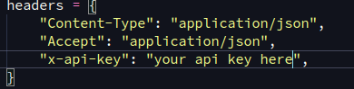

# aof5-downloader
A simple script that downloads all the mods from All Of Fabric 5 and places them in the mods directory

## Installation
```
$ git clone https://github.com/CaduSouza1/aof5-downloader.git
$ cd aof5-downloader
$ pip install -r requirements.txt 
```

## Usage
To use this script, first you will need an API key from curseforge.
Copy the API key from curseforge to the headers dictionary in the main.py file.



After that, simply run:
```
$ python src/main.py
```

After a while, the mods will all be downloaded and placed in the mods directory
